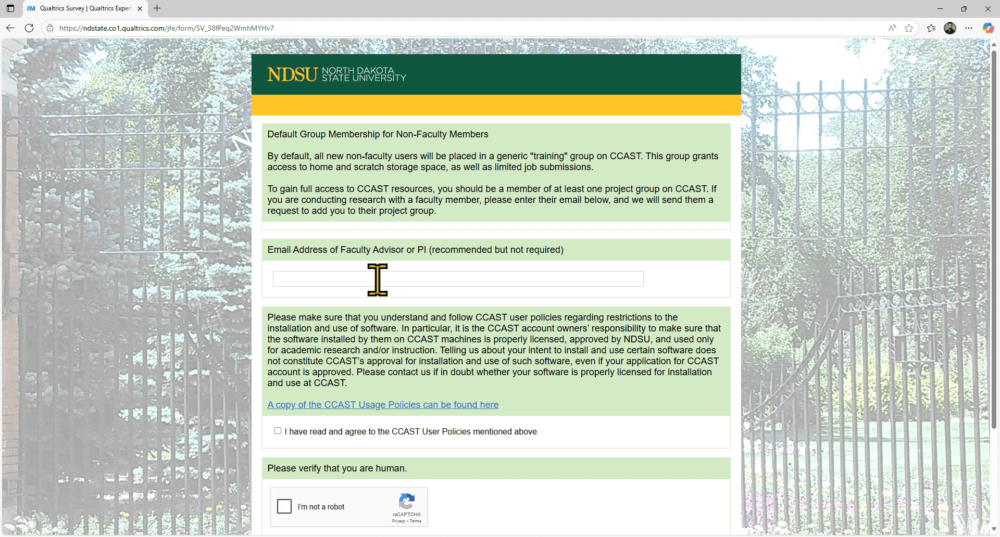
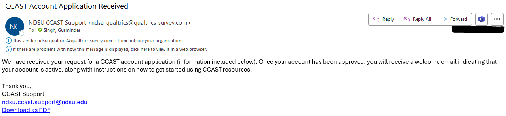
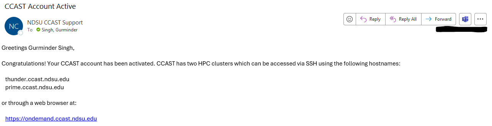

**Step 0: Prerequisites**

Before we can run the applications on NDSU CCAST, make sure you have the following ready:

**1. NDSU Email Address**  
   You must have an active NDSU email (e.g., firstname.lastname@ndsu.edu).
* * *
**2. Apply for a CCAST Account**
   * Go to: <a href="https://www.ndsu.edu/ccast" target="_blank">https://www.ndsu.edu/ccast</a>

   

   * Fill out the online form to request a CCAST account.

   

   ---
   **`After you click on -->, you will see the following window:`**
   

   

   * * *

   **`After you click on -->, You will receive an email from CCAST that "We received your request ..."`**
   

     
   

* * *

**3. Welcome Email**

    You will get another email once your account has been approved and activated.
    
   

* * * 
* * *
* * * 

